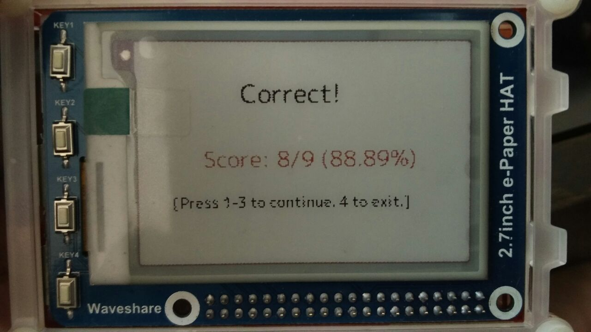

# tomodachi

This is an application I'm making to help me learn
nihongo.

It'll be a "Who Wants to be a Millionaire?" style quiz 
with four options.

First, it'll be for learning the hiragana, the katakana
and the Kanji.

It's designed to be used on the epaper-hat.

## Photos

Questionnaire:

Success Screen:

Wrong Answer Screen:

## TODO:

    [x] Implement basic quiz.
    [x] Implement romaji-hiragana quiz.
    [*] Implement romaji-katakana quiz.
    [*] Implement hiragana-romaji quiz.
    [*] Implement katakana-romaji quiz.
    [*] Implement romaji-kana quiz.
    [*] Implement kana-romaji quiz.
    [*] Implement score log and show top high score list.
    [*] Move the characters to an sqllite database instead of dedicated functions.
    [*] Implement argparse to enable/disable debug.
    [*] Remove the epd module from this repository, fork the original and fix the python3 implementation.
    [*] Implement quiz mode selector at the start screen.
    

-----------------------
